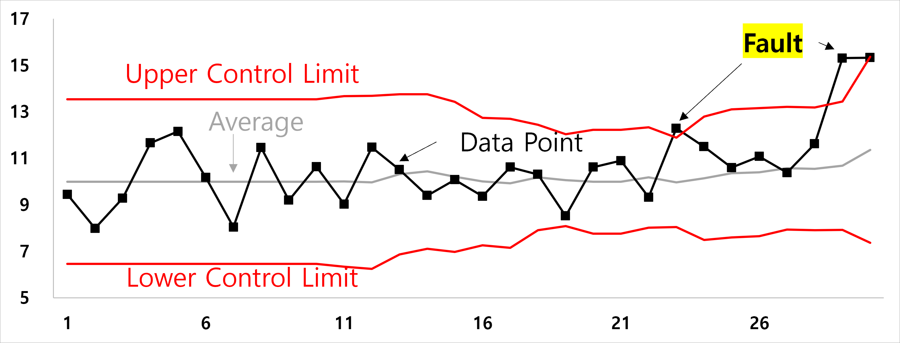
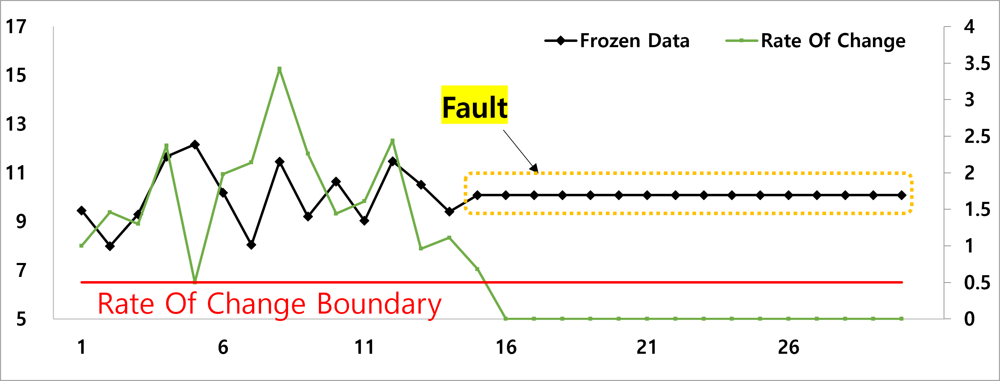
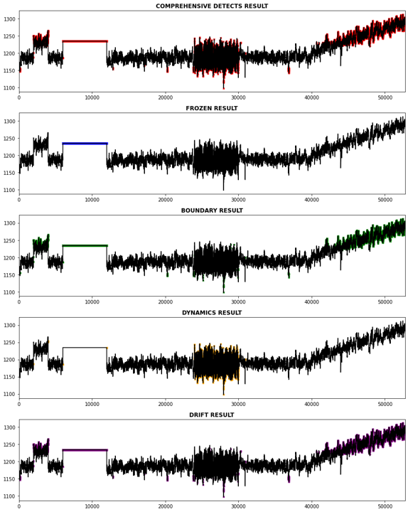

# Univariate Monitoring

조업 데이터를 활용해 제조 공장에서 생산량 및 품질 예측, 실시간 감시, 조기 경보, 성능 예측 등의 활동을 수행하여 생산성 향상을 기대합니다. 실시간 플랜트 감시를 위한 다양한 기법 중, <u><strong>단변량 통계를 활용한 고장 감지</strong></u>에 대한 파이썬 패키지를 작성하였습니다.

공정 이상 징후의 전파속도와 파급 범위에 따라 효과적인 감시를 위한 차별화된 기법이 필요합니다. 다양한 고장 유형을 고려하여 특성에 맞는 차별화된 기법을 적용해야 합니다. 

제조 공장에서 발생할 수 있는 고장 유형은 Bias, Drift, Noise, Frozen, Peak으로 구분할 수 있습니다.
<p align="center">
<br>
Development of sensor validation methodologies for structural health monitoring: a comprehensive review
</p>


각 고장에 대하여 아래의 기법을 사용해 탐지할 수 있습니다
1. Bias 고장 감지: Shewhart 관리도 이용

2. Peak 고장 감지: Shewhart 관리도 응용한 Moving Boundary 이용

3. Peak, Noise 고장 감지: Rate Of Change 이용

4. Frozen 고장 감지: Rate Of Change 이용

5. Drift 고장 감지: CUSUM 통계량 이용

---
각 고장에 활용할 기법 대하여 설명합니다.

1. Shewahrt 관리도

    - Shewhart 관리도는 공정 품질 관리에서 변동성을 모니터링하는 데 사용되는 통계적 도구입니다. 
    - 측정값이 경계(상•하한선)를 벗어나면 비정상 운전으로 판단하고 운전자의 조치를 위해 알람을 발행합니다.
    - 데이터의 평균과 표준 편차를 기준으로 상한선과 하한선을 설정하여 공정 내의 비정상적인 변동을 신속하게 감지할 수 있습니다.
        <ul>𝑈𝑝𝑝𝑒𝑟 𝐶𝑜𝑛𝑡𝑟𝑜𝑙 𝐿𝑖𝑚𝑖𝑡(𝑈𝐶𝐿)=μ + 3𝜎 </ul>
        <ul>𝐿𝑜𝑤𝑒𝑟 𝐶𝑜𝑛𝑡𝑟𝑜𝑙 𝐿𝑖𝑚𝑖𝑡(𝑈𝐶𝐿)=μ - 3𝜎 </ul>
        <p align="center">

        
        </p>
        <br>
2. Moving Boundary
	- Shewahrt 관리도를 응용한 것으로, 데이터의 <strong><u>이동 평균과 이동 표준 편차</strong></u>를 기준으로 상한선과 하한선을 설정하여 공정 내 비정상적인 변동을 신속하게 감지합니다.
    - <strong><u>이동 평균과 이동 표준 편차</strong></u>를 이용하여 경계를 산출했기 때문에 기존의 Shewahrt 관리도보다 엄격한 모니터링을 할 수 있습니다.
    - 이동 평균과 표준편차는 아래의 수식으로 설정합니다.
        <p align="left">

        
        
        
        https://nestedsoftware.com/2019/09/26/incremental-average-and-standard-deviation-with-sliding-window-470k.176143.html
        </p>

        <p align="center">
        
        </p>
        <br>
3. Rate Of Change
	- Rate Of Change(ROC)는 일정 시간 동안 데이터의 변화 속도를 측정하는 지표로 시계열 데이터에서 추세와 변동성을 모니터링하는 지표입니다.
    - ROC를 이용하면 공정 이상 징후를 신속하게 탐지하여 적시에 조치를 취할 수 있습니다.
    - Rate Of Change는 다음과 같은 수식으로 표현됩니다: <br>
        $R_i = (x_i - x_{i-1})$<br>
        여기서 $R_i$는 i번째 시점의 변화율이고, $x_i$는 i번째 시점의 데이터 값입니다.
    - 직전 데이터 n개의 Rate Of Change의 평균값을 이용하여 단순 Peak에 대한 False Alarm을 방지하고자 하였습니다.
    - $R_i$가 일정 값보다 작을 경우, Frozen으로 설정하고 일정 값 이상의 값을 갖을 경우 Noise/비정상 데이터로 감지할 수 있습니다.
        <p align="center">

        
        </p>
        <p align="center">

        
        </p>
        <br>
4. CUSUM
	- CUSUM은 누적합(Cumulative Sum)을 이용한 품질 관리 기법으로, 공정에서 발생하는 작은 변화를 감지하는 데 효과적인 지표입니다.
    - 시계열 데이터에서 평균 이상의 변동을 추적하며, 이를 통해 공정의 이상 징후를 조기에 발견할 수 있습니다.
    - CUSUM 관리도는 Tabular CUSUM과 V-mask CUSUM으로 나눌 수 있고 본 코드에서는 Tabular CUSUM을 이용하였습니다.
    - Tabular CUSUM은 양•음의 변화에 대한 누적합을 각각 CUSUM Plus, CUSUM Minus로 추적할 수 있으며 각각($C_i^+, C_i^-$)이 경계값을 벗어나면 이상으로 감지합니다.<br>
        $C_i^+ = \max(0, C_{i-1}^+ + x_i - (\mu + K))$<br>
        $C_i^- = \min(0, C_{i-1}^- + x_i - (\mu - K))$<br>
        ($x_i$: i번째 데이터, $\mu$: 평균 값, K: 참고 값)
    
        참고값, Reference value(K) $= \frac{\delta}{2}\sigma$ ($\delta$: 감지하고자 하는 변화량의 크기)<br>
        경계값, Control limit (H) $= h\sigma$<br>

        <p align="center">
        
        </p>
<br>
<br>


---
## classify_fault
classify_fault는 단변량 통계를 이용하여 변수의 고장을 감지하는 패키지입니다.

---

### 패키지 구성
```
classify_fault/
    utils/
        convert_type.py
        __init__.py
    bias_monitoring.py
    check_boundary.py
    check_drift.py
    check_frozen.py
    check_dynamics.py
    set_config.py
    update_avg_std.py
    fault_detection.py
    __init__.py
    test/
        __init__.py
        test.py
    config/
        variable_confign.yaml
    example/
        example-all.ipynb
        example-bias.ipynb
        example-boundary.ipynb
        example-drift.ipynb
        example-frozen.ipynb
        example-gain-dynamics.ipynb

```
---

### 모듈 설명
    set_config.py
    데이터 분석에 필요한 변수 설정을 위한 모듈입니다.

    fault_detection.py
    변수 유형을 확인하고, 각 유형의 장애를 감지하는 모듈입니다.

    bias_monitoring.py
    각 변수의 Bias를 모니터링하기 위한 모듈입니다.

    check_boundary.py
    Boundary(경계)를 모니터링하기 위한 모듈입니다.

    check_drift.py
    Drift(드리프트)를 모니터링하기 위한 모듈입니다.

    check_frozen.py
    Frozen(고정)을 모니터링하기 위한 모듈입니다.

    check_dynamics.py
    Dynamics(동적)를 모니터링하기 위한 모듈입니다.

    update_avg_std.py
    평균과 표준편차를 업데이트하기 위한 모듈입니다.
---

### 예시

아래는 example폴더의 example-all~example-gain-dynamics.ipynb의 내용입니다.
```
from classify_fault.set_config import *
from classify_fault.fault_detection import *

data_path = '../data/TemperatureTrain.csv'
data_path2 = '../data/Temperature.csv'
config_save_path = '../config/example_config.json'

# 훈련 데이터와 테스트 데이터를 불러옵니다.
train_data = pd.read_csv(data_path, index_col=[0])
test_data = pd.read_csv(data_path2, index_col=[0])
tag_list = train_data.columns.to_list()
test_tag_list = ['temp5All']

detecteds = []  # 경계 초과 결과에 대한 리스트
keys = ['frozen', 'boundary', 'dynamics', 'drift']
frz_res, bounds_res, dyn_res, drft_res = [], [], [], []

for i in tqdm(range(tracking_size, len(test_data))):
    config = load_config(json_file_path='../config/example_config.json')
    frozen_threshold = config[tag_list[0]]['frozen_threshold']
    boundary_limits = config[tag_list[0]]['boundary_limits']
    dynamic_threshold = config[tag_list[0]]['dynamic_threshold']
    drift_params = config[tag_list[0]]['drift_params']

    test_ = test_data[test_tag_list].values[i - tracking_size: i, :].ravel()  # make 1d array

    origin_value = test_data[test_tag_list].values[i][0]
    res = detect_fault(data=test_,
                        tracking_size=tracking_size,
                        frozen_threshold=frozen_threshold,
                        boundary_limits=boundary_limits,
                        dynamic_threshold=dynamic_threshold,
                        drift_params=drift_params, config_path=config_save_path,
                        tag=tag_list[0],
                        boundary_type='moving')
    result = get_matching_keys(res)    
    
    frz_res.append(True if result and 'frozen' in result else None)
    bounds_res.append(True if result and 'boundary' in result else None)
    dyn_res.append(True if result and 'dynamics' in result else None)
    drft_res.append(True if result and 'drift' in result else None)

    detecteds.append(True if result else None)
```

<br>
<br>

---
아래의 그림에서 확인할 수 있듯이 단변량 통계를 이용한 공정 모니터링은 공정 감시를 위한 다양한 기법 중 하나입니다.


